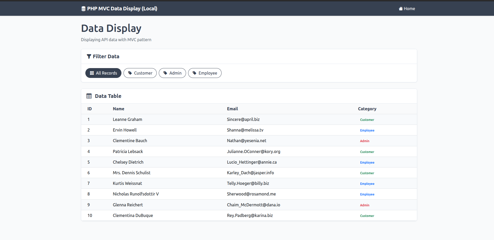

# PHP MVC Data Display

A simple PHP MVC application that loads and displays data from JSONPlaceholder API in a table with filtering capabilities.

## Features

- Follows MVC architecture pattern
- Fetches data from JSONPlaceholder API (with local JSON backup)
- Displays data in a Bootstrap-styled table
- Allows filtering data by category using GET parameters
- Responsive design
- Supports both local development and Docker environments
- Industry-standard logging system

## Application Demo

Below is a screenshot of the application showing the data table with category filtering:



## Directory Structure

```
.
├── app/                    # Application code
│   ├── config/             # Configuration files
│   │   ├── config.php      # Default configuration
│   │   ├── config.docker.php # Docker environment config
│   │   └── config.local.php  # Local environment config
│   ├── controllers/        # Controller classes
│   │   └── Data.php        # Main data controller
│   ├── core/               # Core framework classes
│   │   ├── App.php         # Main application class for routing
│   │   ├── Controller.php  # Base controller class
│   │   └── Logger.php      # Logging system
│   ├── data/               # JSON data backup
│   │   └── data.json       # API data backup
│   ├── helpers/            # Helper functions
│   │   ├── logger_helper.php # Logging helper functions
│   │   └── url_helper.php    # URL helper functions
│   ├── logs/               # Application logs
│   │   └── app.log         # Main log file
│   ├── models/             # Model classes
│   │   └── DataModel.php   # Data handling model
│   └── views/              # View files
│       ├── data/           # Data view templates
│       │   └── index.php   # Main data display template
│       └── inc/            # Included templates
│           ├── footer.php  # Footer template
│           └── header.php  # Header template
├── public/                 # Publicly accessible files
├── Dockerfile              # Docker configuration for Apache setup
├── docker-compose.yml      # Docker Compose configuration for Apache setup
├── docker-compose.php.yml  # Simplified Docker Compose using PHP built-in server
├── docker-index.php        # Simple Docker test file
├── docker-router.php       # Router for PHP built-in server
├── docker-test.php         # Docker environment test file
├── index.php               # Application entry point
├── README.md               # This file
├── run-docker-simple.sh    # Script to run Docker with PHP built-in server
├── setup-docker.sh         # Script to set up Docker environment
└── setup-local.sh          # Script to set up local environment
```

## Data Source

The application fetches user data from the JSONPlaceholder API (https://jsonplaceholder.typicode.com/users) and assigns random categories (customer, admin, employee) to each user for demonstration purposes. If the API is unavailable, it falls back to a local JSON file.

## Installation

### Local Development Environment

1. Clone this repository
2. Make sure you have PHP 7.0+ installed
3. Run the setup script:
   ```
   ./setup-local.sh
   ```
4. Run the built-in PHP server:
   ```
   php -S localhost:8000
   ```
5. Access the application at http://localhost:8000

### Docker Environment (Simple Method)

1. Clone this repository
2. Make sure you have Docker and Docker Compose installed
3. Run the simplified Docker setup script:
   ```
   ./run-docker-simple.sh
   ```
4. Access the application at http://localhost:8080

### Docker Environment (Apache Method)

**Note: This method is more complex and may require additional configuration.**

1. Clone this repository
2. Make sure you have Docker and Docker Compose installed
3. Run the setup script:
   ```
   ./setup-docker.sh
   ```
4. Build and run the Docker container:
   ```
   docker compose up -d --build
   ```
5. Access the application at http://localhost:8080

## Logging System

The application includes an industry-standard logging system with the following features:

- PSR-3 inspired logging with multiple log levels (emergency, alert, critical, error, warning, notice, info, debug)
- Log file rotation when files exceed 5MB
- Formatted logs with timestamp, level, IP address, URI, message, and context data
- Various helper functions for easier logging
- Integrated throughout the application for request tracking, error handling, and data operations

Log files are stored in `app/logs/app.log` and can be accessed to troubleshoot issues or monitor application behavior.

Example log entry:
```
[2025-05-14 23:29:36] [INFO] [172.19.0.1] [/] Application started {"environment":"docker"}
```

## Troubleshooting Docker Setup

If you encounter issues with the Docker setup, try these steps:

1. Verify Docker is running:
   ```
   docker --version
   docker compose version
   ```

2. Try the simpler Docker setup:
   ```
   ./run-docker-simple.sh
   ```

3. Check if the container is running:
   ```
   docker compose ps
   ```

4. View container logs:
   ```
   docker compose logs
   ```

5. If you make changes to the code, rebuild the Docker container:
   ```
   docker compose down
   docker compose up -d --build
   ```

6. Ensure proper file permissions:
   ```
   sudo chown -R $USER:$USER .
   ```

## Configuration

The application uses different configuration files based on the environment:

- `app/config/config.php` - Default configuration for Apache
- `app/config/config.local.php` - Configuration for local development with PHP built-in server
- `app/config/config.docker.php` - Configuration for Docker environment

## Usage

- Access the application through your web browser
- You can filter the data by clicking on the category buttons
- The URL will update with the category parameter (e.g., `?category=admin`) 